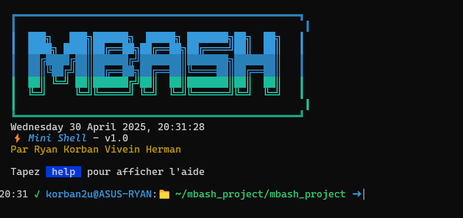

# 📁 mbash – Mini Shell

<div align="center">



[](LICENSE)
[]()
[]()
[]()

</div>

<p align="center">
  <b>Un shell Unix léger avec une belle interface utilisateur </b>
</p>

---

## 🌟 Caractéristiques

- **🔍 Complétion intelligente** des commandes et chemins avec affichage visuel
- **📚 Historique des commandes** bien formaté et facile à naviguer
- **🔄 Exécution en arrière-plan** avec le symbole `&`
- **📁 Navigation intuitive** dans le système de fichiers
- **💻 Mode d'édition avancé** avec support des touches fléchées et raccourcis clavier
- **📝 Variables d'environnement** accessibles avec `$`
- **🔧 Configuration personnalisable** via fichier `.mbashrc`
- **🔄 Support des commandes multiples** séparées par `;`

---

## 🚀 Installation

### Prérequis

- GCC ou tout autre compilateur C standard
- Système Unix/Linux compatible avec les bibliothèques standard
- Émulation de terminal avec support UTF-8 et ANSI color

### Compilation depuis les sources

```bash
# Cloner le dépôt
git clone https://github.com/korban2u/SAE_mbash.git
cd mbash

# Compiler avec Make
make

# Ou compiler manuellement
gcc -Wall -Wextra -O2 -o mbash src/mbash.c

# Installation (optionnelle)
sudo make install
```

### Tester l'installation

```bash
./mbash
```

---

## 🔧 Utilisation

### Commandes intégrées

| Commande          | Description                          |
| ----------------- | ------------------------------------ |
| `cd <dir>`        | Changer de répertoire                |
| `pwd`             | Afficher le répertoire courant       |
| `set <VAR> <val>` | Définir une variable d'environnement |
| `echo <texte>`    | Afficher du texte (supporte $VAR)    |
| `history`         | Afficher l'historique des commandes  |
| `help`            | Afficher l'aide du shell             |
| `exit`            | Quitter mbash                        |

### Raccourcis clavier

| Touche     | Action                             |
| ---------- | ---------------------------------- |
| `Tab`      | Compléter les commandes et chemins |
| `↑/↓`      | Naviguer dans l'historique         |
| `←/→`      | Déplacer le curseur                |
| `Home/End` | Aller au début/fin de ligne        |
| `Ctrl+C`   | Interrompre la commande en cours   |
| `Ctrl+D`   | Quitter mbash (EOF)                |

### Fonctionnalités avancées

```bash
# Exécution en arrière-plan
long_command &

# Variables d'environnement
echo $HOME
set MY_VAR valeur

# Commandes multiples
cd /tmp; ls -la; echo "Done"

# Utilisation des globs
ls *.txt
```

---

## ⚙️ Configuration

mbash peut être configuré via un fichier `.mbashrc` dans votre répertoire home.

```bash
# Exemple de .mbashrc
set PATH $PATH:/usr/local/bin
set PS1 "[\u@\h \W]$ "
set EDITOR nano

# Alias personnalisés (si supportés dans votre version)
alias ll='ls -la'
alias c='clear'
```

---

## 🛠️ Architecture du projet

```
mbash/
├── LICENSE
├── Makefile
├── README.md
├── docs/
│   └── manual.md
├── src/
│   ├── mbash.c       # Code principal
│   ├── buffer.h      # Gestion du buffer d'édition
│   ├── commands.h    # Implémentation des commandes intégrées
│   ├── completion.h  # Système de complétion
│   ├── terminal.h    # Gestion du terminal et de l'affichage
│   └── utils.h       # Fonctions utilitaires
└── tests/
    └── test_suite.c  # Tests unitaires
```

---

## 🔍 Fonctionnement interne

mbash est conçu selon les principes de conception Unix, avec une architecture modulaire et extensible:

1. **Terminal non-canonique**: permet l'édition de ligne caractère par caractère
2. **Buffer d'édition**: gère l'insertion, la suppression et la navigation
3. **Analyse de commandes**: séparation des arguments et interprétation
4. **Exécution**: fork, exec et wait pour les processus enfants
5. **Gestion des signaux**: capture SIGCHLD, SIGINT, etc.
6. **Interface utilisateur**: rendu avec couleurs ANSI et caractères Unicode

### Diagramme de flux

```
Démarrage → Initialisation → Boucle principale → [Lire ligne → Analyser → Exécuter] → Fin
```

---

## 📜 Licence

Ce projet est sous licence MIT - voir le fichier [LICENSE](LICENSE) pour plus de détails.

---

## 🙏 Développeurs

- Ryan Korban et Vivein Herman dans le cadre d'une SAE


